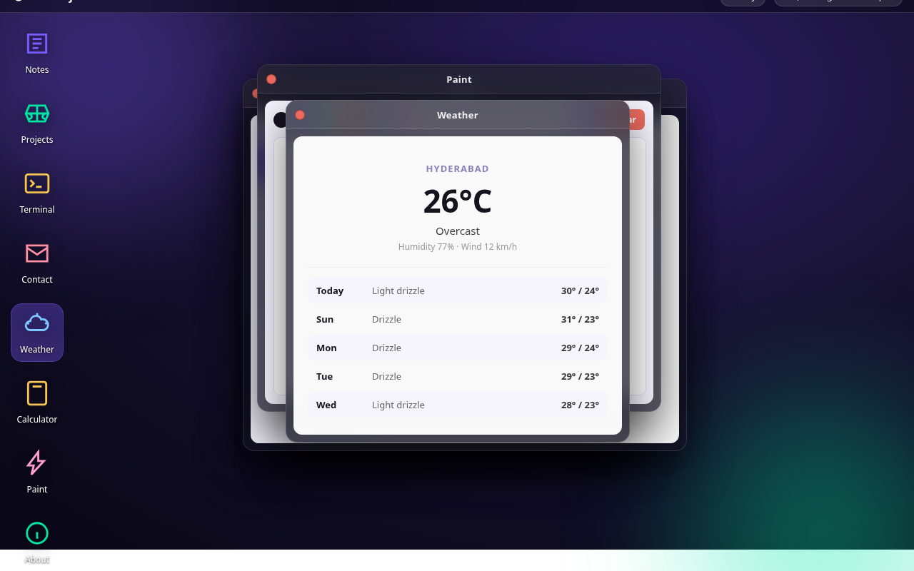

# BalajiOS

An interactive, browser-based personal operating system that runs entirely on the web — built from scratch with plain HTML, CSS, and JavaScript. Boot in, drag the windows around, and explore Sri Balaji's world through his apps instead of reading a static portfolio page.



## Try it

**Live demo: https://dsribalaji.github.io/webos/**

Click "Boot", then:
- Drag the Welcome window around by its header
- Open Notes and switch between the four essays in the sidebar
- Open Terminal and type `help` — try `sudo make me a coffee`
- Open Weather to see today's forecast in Hyderabad
- Open Paint and draw something with the canvas
- Open Projects and click a card to learn about real work

## Features

- Login screen with boot animation
- Live clock in the top bar, updating every second
- Draggable, stackable windows with z-index management
- Notes app: a sidebar reader with 4 personal essays
- Projects app: clickable cards for real projects
- Terminal app: a working shell with help, about, projects, skills, contact, date, echo, sudo, clear, exit, whoami
- Weather app: live Hyderabad forecast from Open-Meteo (free API, no key)
- Calculator app: full arithmetic with chained operations
- Paint app: canvas drawing with 8 colors and 3 brush sizes
- Contact app: clickable cards for email, GitHub, LinkedIn, Stardance
- About app: education, focus, skills, current builds
- Glassmorphism design with inline SVG icons, custom scrollbars, no frameworks

## Run it locally

This is a static site — no build step, no dependencies.

```bash
git clone https://github.com/dsribalaji/webos.git
cd webos
python3 -m http.server 8000
# open http://localhost:8000
```

Any static file server works. There are no environment variables and nothing to install.

## How it works

Three files, zero dependencies:

| File | Purpose |
|------|---------|
| `index.html` | OS structure: top bar, desktop, windows, login screen |
| `style.css` | All styling — theme, windows, apps, terminal, login |
| `script.js` | All logic — clock, window manager, drag, apps, terminal |

The OS is a single-page app. A `biggestIndex` counter manages window stacking; a W3-pattern drag handler moves windows by their headers; the terminal is a command switch on the input; the notes app renders content from a JavaScript array into a clickable sidebar. Everything is vanilla — the point was to prove a personal OS needs no framework.

## Credits

Built by Sri Balaji Dangeti as part of Hack Club's Stardance challenge, following the Hack Club WebOS Jams batch by SerenityUX (with a community tip from jianmin-chen).
